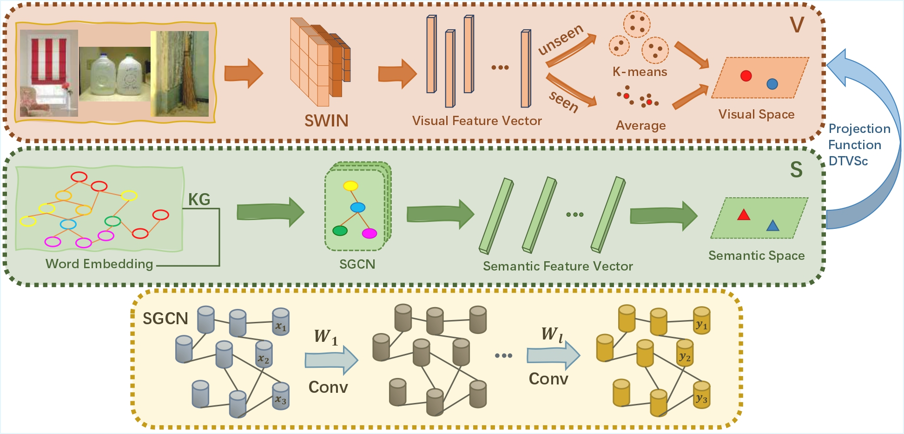
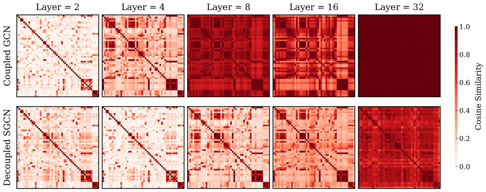
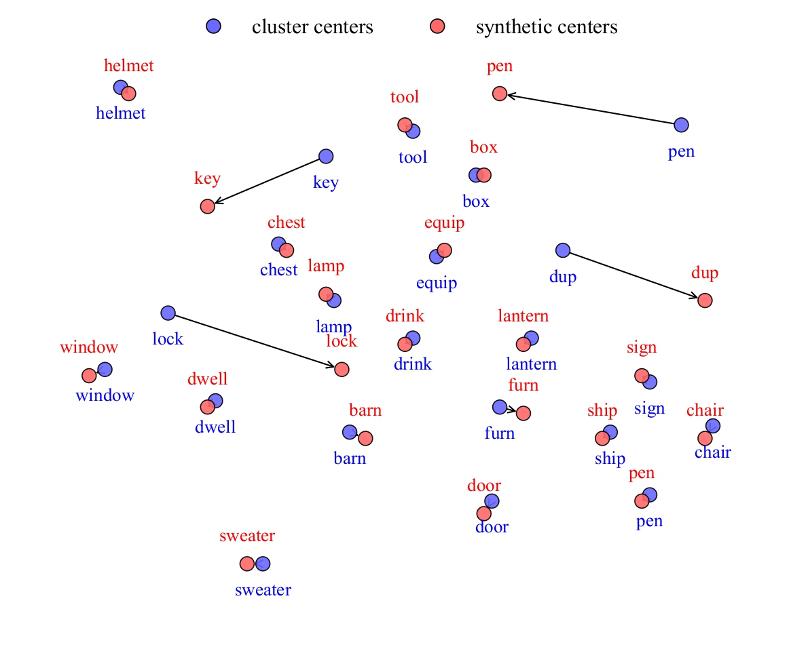
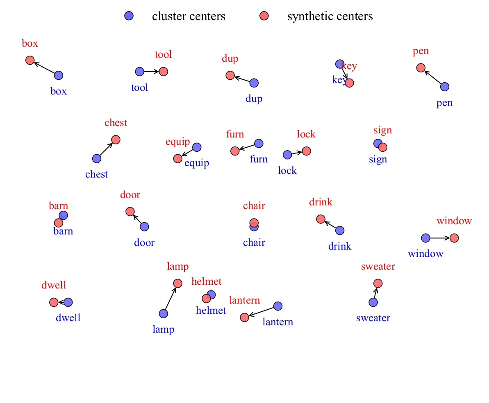

# T-SGCN: Transductive Decoupled Semantic Graph Convolution for Zero-Shot Object Recognition

<p align="center"> •
  <a href="#-introduction"> 📖 Introduction</a> •
  <a href="#-framework"> 🧩 Framework</a> •
  <a href="#-dataset-and-preparation">🎉 Dataset & Preparation</a> •
  <a href="#-quick-start">🚀 Quick Start</a> 
</p>
<p align="center" dir="auto"> •
  <a href="#-experimental-results">📃 Experimental Results</a> •
  <a href="#-analysis-gallery">📊 Analysis Gallery</a> •
  <a href="#-contact">📧 Contact</a> 
</p>

<div align="center">
  
</div>

# 📖 Introduction

This repository contains the official PyTorch implementation of **T-SGCN** (Transductive Semantic Graph Convolutional Network), a novel framework designed for **Zero-Shot Learning (ZSL)** in dynamic indoor robotic environments.

Conventional object recognition relies on closed-set assumptions, failing to scale in real-world service robotics where object categories evolve continuously. To address this, we propose **T-SGCN**, which effectively bridges the semantic-visual gap without relying on costly manual attribute annotations.

**Key Contributions:**

- **Decoupled SGCN Architecture:** Unlike traditional coupled GCNs, we explicitly separate the graph feature enrichment from the semantic-visual projection. This design effectively mitigates the Laplacian Smoothing Effect, preserving fine-grained discriminative features for visually similar indoor objects (e.g., *Mug* vs. *Cup*).
- **Dynamically Tuned Visual Structure Constraint (DTVSc):** We introduce a dynamic entropy regularization mechanism that intelligently transitions from global distribution alignment (Soft Matching) to fine-grained point-to-point mapping (Hard Matching) during training.
- **EDO Benchmark:** We release the Everyday Domestic Objects (EDO) dataset, specifically constructed to benchmark ZSL performance in complex indoor scenarios.

# 🧩 Framework

Our method consists of three core components:
1.  **Visual Space:** Uses **Swin Transformer** to extract robust features and clusters unseen data to form visual centers.
2.  **Semantic Space:** Utilizes a **Knowledge Graph (WordNet)** and our **Decoupled SGCN** to propagate semantic information.
3.  **Visual-Semantic Interaction:** Aligns the two spaces using a regression loss for seen classes and the **DTVSc** loss for transductive alignment of unseen classes.

# 🎉 Dataset and Preparation

## 1. Datasets
We evaluate on four datasets. Please download and unzip them into your data directory (e.g., `/data/`).

* **EDO (Ours):** Specialized for indoor domestic objects. [Download Link](https://github.com/Haohao378/TSGCN-ZSL/blob/main/EDO.zip)
* **Standard Benchmarks:** AWA2, CUB, SUN (Follow standard ZSL split protocols).

## 2. Download External Resources
Before running the code, you must prepare the following external models.

#### (1) GloVe Word Embeddings
We use 300-dim GloVe embeddings for semantic representation.
1. Download `glove.6B.zip` from [Stanford NLP](https://nlp.stanford.edu/projects/glove/).
2. Unzip and place `glove.6B.300d.txt` in the project root directory (same level as `config/` and `SGCN/`).

#### (2) Swin Transformer Backbone
We use `swin_base_patch4_window7_224` as the backbone.
1. Download the model files (`config.json`, `pytorch_model.bin`, etc.) from [Hugging Face: microsoft/swin-base-patch4-window7-224](https://huggingface.co/microsoft/swin-base-patch4-window7-224/tree/main).
2. Save them to a local folder (e.g., `./checkpoints/swin_base`).

#### (3) NLTK WordNet
Our knowledge graph construction relies on WordNet. Run the following command to download the necessary data:

```Bash
python -c "import nltk; nltk.download('wordnet'); nltk.download('omw-1.4')"
```
## 2. Directory Structure
Ensure your project directory looks like this:

```text
TSGCN-ZSL/
├── glove.6B.300d.txt        <-- GloVe file
├── checkpoints/
│   └── swin_base/          <-- Swin Transformer weights
├── config/
│   ├── train_SGCN_EDO.yml   <-- Key Configuration File
│   └── parser.py
├── data/
│   ├── EDO/                 <-- Dataset Images
│   │   ├── chair/
│   │   ├── cup/
│   │   └── ...
│   ├── w2v/                 <-- GloVe Word Embeddings
│   └── class_lists/         <-- Split definitions
├── SGCN/
│   ├── train.py
│   ├── Feature_extractor.py
│   └── ...
└── figures/
```

## 3. Configuration (YAML)

We use YAML files to manage paths and hyperparameters. Below is a template for `config/train_SGCN_EDO.yml`. **You must create this file before training.**

```yaml
# config/train_SGCN_EDO.yml
experiment: "EDO_Experiment"
data:
  dataset: "EDO"
  # Path to the dataset root containing class folders
  data_dir: "/media/data/EDO/images" 
  # Directory containing class name lists (train_class.txt, test_class.txt)
  classes_dir: "/media/data/EDO/class_lists/classes.txt"
  train_class_list: "/media/data/EDO/class_lists/train_class.txt"
  test_class_list: "/media/data/EDO/class_lists/test_class.txt"
  resnet_path: "/path/to/res101.mat"
  # Semantic Embeddings
  attribute_dir: "/media/data/EDO/attributes/glove_embeddings.npy"
  # Output directory for logs and saved models
  out_dir: "./checkpoints/EDO"
  # Hyperparameters defined in dataset
  classNum: 80        # Number of Seen Classes
  unseenclassnum: 20  # Number of Unseen Classes
  input_dim: 300      # Dimension of Word Embeddings (GloVe)
method:
  name: "DTVSc"       # Method choice: VCL, CDVSc, BMVSc, WDVSc, DTVSc
  max_epoch: 10000
  lamda: 0.1          # Regularization weight
  hidden_layers: "2048,2048"
```

# 🚀 Quick Start

## ⚙️ Prerequisites

```bash
# Clone the repository
git clone https://github.com/Haohao378/TSGCN-ZSL.git
cd TSGCN-ZSL
# Install dependencies
pip install -r requirements.txt
```

## 🛠️ Operational Flow

**Step 1: Feature Extraction**
Extract visual features using the pre-trained Swin Transformer backbone. This generates the Visual Centers (VC) needed for training.

```bash
python SGCN/Feature_extractor.py \
  --data_dir /media/data/EDO \
  --datasets EDO \
  --train_class_list /media/data/EDO/train_list.txt \
  --test_class_list /media/data/EDO/test_list.txt \
  --out_dir ./outputs/EDO \
  --cluster_method SC
```

**Step 2: Training (T-SGCN)**
Train the Decoupled SGCN model with the DTVSc constraint.

```bash
python SGCN/train.py \
  --config config/train_SGCN_EDO.yml \
  --method DTVSc \
  --lamda 0.1 \
  --max_epoch 10000
```

**Step 3: Evaluation**
Evaluate the performance on unseen classes (ZSL) or both seen/unseen classes (GZSL).

```bash
python SGCN/test.py \
  --config config/train_SGCN_EDO.yml \
  --method DTVSc \
  --suffix "_Pred_Center"
```

# 📃 Experimental Results

Our method consistently outperforms state-of-the-art baselines on both the custom EDO dataset and standard benchmarks.

| Dataset | Metric | VCL | CDVSc | BMVSc | WDVSc | **DTVSc (Ours)** |
| :---: | :---: | :---: | :---: | :---: | :---: | :---: |
| **EDO** | **Acc (CZSL)** | 61.1 | 69.0 | 79.4 | 83.9 | **94.6** |
| | **H-Mean (GZSL)** | 36.1 | 72.9 | 78.9 | 79.4 | **88.6** |
| **AWA2** | **Acc (CZSL)** | 53.9 | 64.1 | 78.3 | 87.1 | **98.2** |
| | **H-Mean (GZSL)** | 21.5 | 74.4 | 82.7 | 84.9 | **93.1** |

> **Analysis:** DTVSc achieves the best trade-off between precision and stability, significantly outperforming the rigid hard-matching (BMVSc) and imprecise soft-matching (WDVSc).

# 📊 Analysis Gallery

### 1. Solving the Smoothing Problem

*Comparison of Cosine Similarity Matrices at varying GCN depths.*
The **Decoupled SGCN** (Bottom) maintains distinct diagonal features even at deep layers (L=32), whereas the coupled baseline (Top) suffers from severe over-smoothing (feature collapse).


### 2. Visual Structure Constraint Analysis

*Visualizing the limitations of existing constraints: The trade-off between rigid precision and distributional stability.*

| **BMVSc (Hard Matching)** | **WDVSc (Soft Matching)** |
| :---: | :---: |
|  |  |
| **Rigid Mapping**<br>Enforces strict one-to-one constraints. While geometrically tight, it causes **catastrophic mismatches** for outliers (e.g., *'pen'*, *'key'*) due to forced assignments. | **Soft Mapping**<br>Uses global distributional alignment. While it avoids severe mismatches, it lacks precision—synthetic centers only drift **near** the target clusters without perfectly overlapping. |

# 📧 Contact

**Author:** Shuhao Liu & Feng Luan
**Institution:** Northeastern University, China
**Email:** 3220924286@qq.com